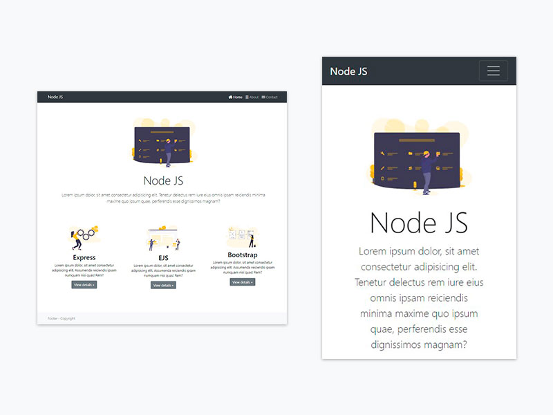

# Workshop - Nodejs web dinámica

## Descripción

Aprender a crear un sitio web completamente desde cero utilizando Nodejs, y Express. este ejemplo plantea la creación de un sitio con una navegación dinamica de manera similar como se haría con PHP.

Navegación dinámica, las rutas funcionan haciendo peticiones a un servidor de nodejs

## Dependencias usadas:
**NodeJS**

Entorno de ejecución para javascript en el servidor

**Express**

Microframework para montar un servidor web en nodejs

**ejs**

Montor de plantillas en javascript

**Bootstrap**

Framework CSS para grid, layout, nav, etc

**Font Awesome**

Fuente de iconos

